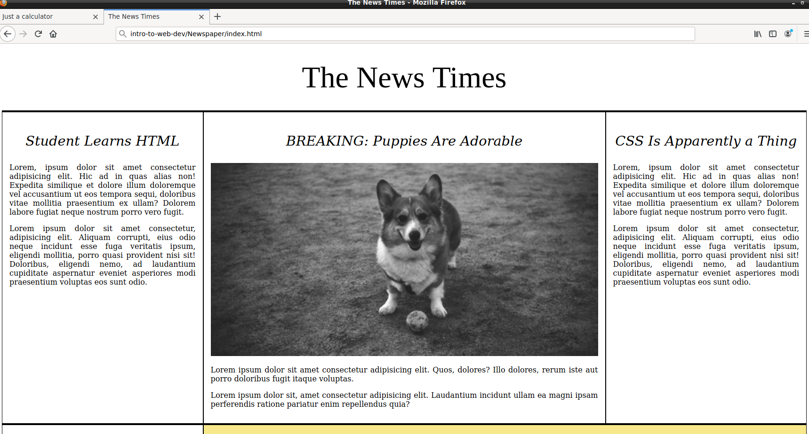
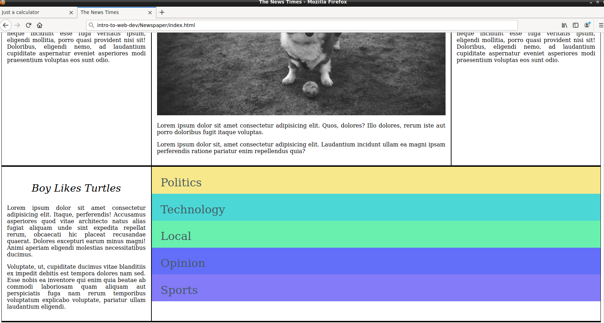

# HTML5, CSS3 and JavaScript projects

**These are my versions of the projects in the ['Intro to web dev'](https://frontendmasters.com/courses/web-development-v2/ 'Complete intro to web dev, V2') course by [Brian Holt](https://twitter.com/holtbt "Twitter profile") at [Frontend Masters](https://frontendmasters.com/ 'Frontend Masters web page')**

- **[`Newspaper`](Newspaper/):  Front page of a newspaper.**
- **[`Calculator`](Calculator/): My version of a calculator.**
- **[`Compliments & Insults`](https://github.com/juliospau/practicas-docker/tree/master/compliments-insults): Get random compliments or insults**

## Resultados
### Newspaper

### Calculator

### Compliments and Insults

